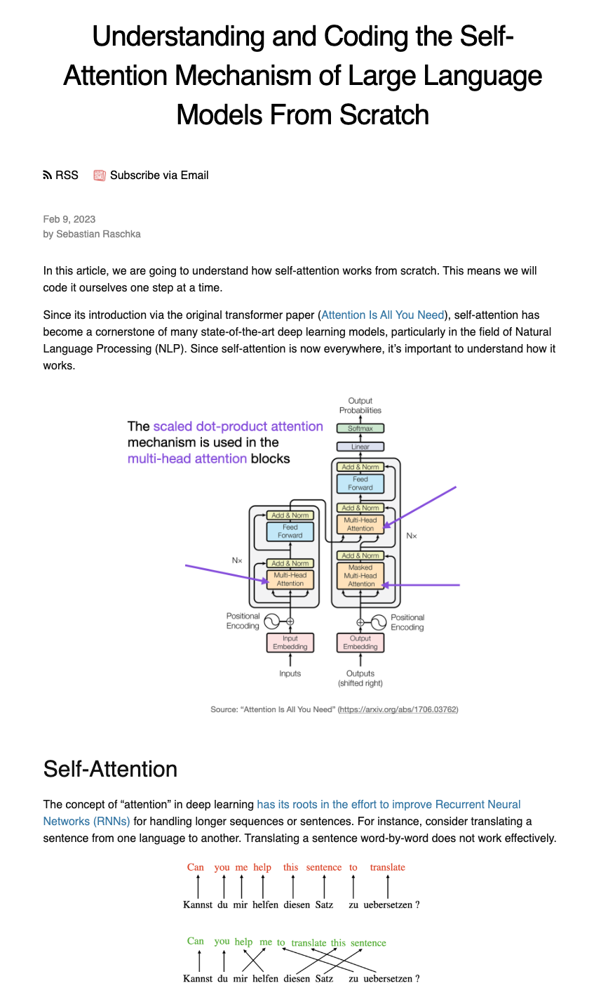
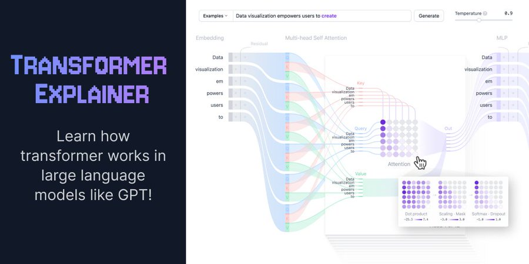
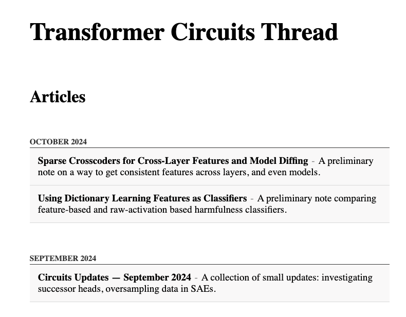
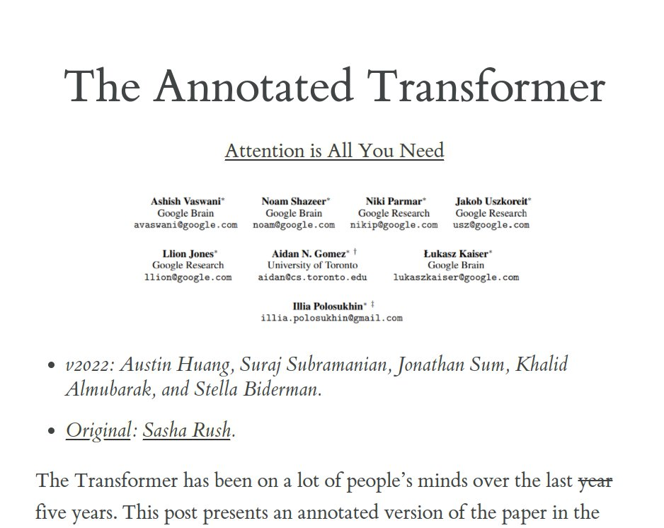
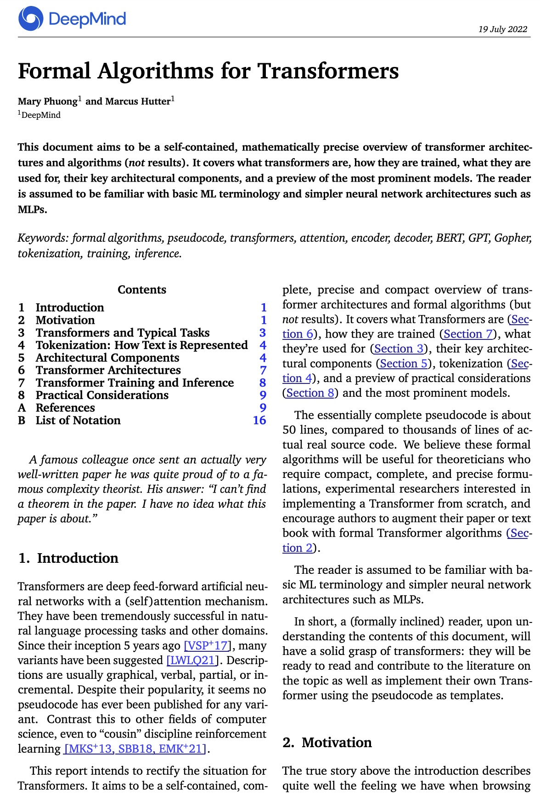

# People

## [Lucas Beyer](https://lucasb.eyer.be/#home) (Twitter: [@lucasbey](https://x.com/giffmana))
- Transformer tutorial from "07.2024 ICML DMLR workshop" keynote (must-read): [slides](http://lucasb.eyer.be/transformer) - [Video](https://icml.cc/virtual/2024/38298)
- [Other talks collection](https://lucasb.eyer.be/snips/talks.html)

 

# Videos
Prof. Jia-Bin Huang's videos:
- [How Attention Got So Efficient](https://www.youtube.com/watch?v=Y-o545eYjXM)
- [Beyond Softmax: The Future of Attention Mechanisms](https://www.youtube.com/watch?v=pUCWwGR5WmQ)

 

3Blue1Brown's videos starting from `Large Language Models explained briefly`, then from chapter `5` to `7`:
- [Large Language Models explained briefly](https://www.youtube.com/watch?v=LPZh9BOjkQs&list=PLZHQObOWTQDNU6R1_67000Dx_ZCJB-3pi&index=5)

 

# Explaination / Visualization
- [Understanding and Coding the Self-Attention Mechanism of Large Language Models From Scratch](https://sebastianraschka.com/blog/2023/self-attention-from-scratch.html) from [Sebastian Raschka](https://sebastianraschka.com/)
    

Click to show image
 

    
    

 

- [Transformer Explainer](https://poloclub.github.io/transformer-explainer/)
    

Click to show image

    
    

 

- [Transformer Circuits Thread](https://transformer-circuits.pub/)
    

Click to show image
 

     
    

 

- [The Annotated Transformer](https://nlp.seas.harvard.edu/annotated-transformer/)
    

Click to show image
 

    
    

 

- [Formal Algorithms for Transformers](https://arxiv.org/abs/2207.09238)
    

Click to show image
 

    
    

 

# Practice
- [Transformer Puzzles](https://github.com/srush/Transformer-Puzzles) from [Professor Alexander Rush](https://rush-nlp.com/). Also check out his [Puzzle collection](https://github.com/srush?tab=repositories&q=Puzzles&type=&language=&sort=).
